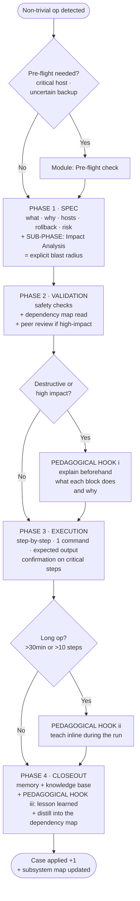

# Cordada — roped-team operations

> In mountaineering, a *cordada* (rope team) is a group of climbers **tied together by a rope**. If one falls, the others hold them. Nobody climbs alone.
>
> **The Cordada method** = when you run a non-trivial technical operation, you are roped to **spec + impact analysis + peer review + memory + knowledge base + lesson learned**. If you slip on one step, the system holds you — and you learn in the process.

Cordada is a lightweight operational framework for changes that are risky enough to hurt if they go wrong, but routine enough that a full change-management ceremony would be overkill. It bundles a small spec, an explicit blast-radius analysis, a validation gate, step-by-step execution, and a closing step that captures what you learned so the next operation is faster and safer.

It carries a second, deliberate goal: the operator should **grow**, not just execute. That is what the pedagogical hooks are for.

---

## When to use

Non-trivial technical operations on live infrastructure:

- Migrations (container to VM, host moves, hypervisor changes)
- Production deploys
- Destructive changes (`DROP`, VM/container destroy, `tune2fs`, edits to `/etc/`)
- Critical configuration (domain controllers, TLS certs, group policy, firewall, IPsec)
- Restarting production services whose blast radius is not fully known (e.g. `systemctl restart <service>`)
- Network changes (ports, protocols, routes) with unclear dependencies
- Updates and patches where you fear breaking dependents
- Incidents that affect operations

## When NOT to use

- Individual password resets
- Extending a volume on a blank disk
- Opening or closing a firewall port on a non-critical host
- UI tweaks or personal config files
- Everyday single-user support tickets
- Read-only exploration or non-destructive diagnostics
- One-off single-command scripts

For those, use **Cordada lite** (rollback plan + common sense + minimal closeout) described in Variants.

---

## Flow at a glance



---

## Steps

The core is four mandatory phases.

### 1. Spec + Impact Analysis

**Deliverable:** 3-5 lines of spec plus an explicit impact-analysis block.

Tip: for the most extreme operations, consider working in a "plan" mode that forces the spec before any material action (blocking edits and command execution until you approve the plan).

#### 1.a — Base spec

```
WHAT:       <concrete action — 1 line>
WHY:        <operational or business reason>
HOSTS:      <fqdn / IPs / container/VM IDs affected>
ROLLBACK:   <how to undo if it fails>
RISK:       <plausible worst case>

# Architectural prerequisites
PREREQUISITES:
  - <reference any architectural decision required when the target is a tier-0
    critical host, or is "no-go for canary" because it is a single point of failure>
  - state: formally approved | conceptual | n/a
  - IF state != "formally approved" AND target is a critical host → BLOCK, do not execute.
```

**Hard rule:** if the target host is on your critical-hosts list (technical tier-0, or no-go-for-canary because it is a single point of failure), the associated architectural decision must be a **formally approved document**, not just a concept mentioned in passing.

#### 1.b — Impact Analysis (mandatory sub-phase)

```
DIRECT DEPENDENCIES:     <who consumes this service/host>
REVERSE DEPENDENCIES:    <who blocks or conditions this service>
EXPOSED APIs / endpoints: <external consumers>
JOBS / crons / triggers:  <processes that will touch this during the window>
AFFECTED USERS:           <humans who will feel the impact>
BLAST RADIUS if it fails: <how far the maximum damage reaches>
SUCCESS SIGNALS:          <which dashboards / logs confirm OK>
```

**Source for the analysis:** read the subsystem's **dependency map** first. If none exists, create it during this operation (incremental distillation). This is what makes the method *grow*: every operation enriches the map, so the next impact analysis is faster.

### 2. Validation

#### 2.a — Safety checks

1. **Exact command** — read character by character.
2. **Correct system** — `hostname`, `whoami`, `pwd`, `ls` confirm where you are.
3. **Reversible** — do you have a rollback? Is it tested?
4. **Backup** — is there a recent, verifiable backup?
5. **(plus)** — what does the subsystem's accumulated memory say about this operation?

#### 2.b — Dependency map

Read the subsystem's dependency map note. If your Phase 1 impact analysis contradicts the map, resolve the discrepancy **before** proceeding.

#### 2.b-bis — Release-candidate anti-stacking

Before installing or upgrading a component, verify you are not stacking a release-candidate version on top of another component that is already a release candidate on the same host.

```bash
# For each related component on the target host:
dpkg -s <component> 2>/dev/null | grep ^Version: | head -1
# If the output contains "rc", "beta", "alpha", "snapshot" → STOP.
# Check your target-stable-versions table.
```

Maintain a simple human-curated table of target stable versions, for example:

```csv
component,current_stable,rc_to_avoid,review_date
example-manager,4.13.5,4.14.x-rc*,2026-08-01
example-agent,4.13.5,4.14.x-rc*,2026-08-01
```

**Exception:** if the whole stack is intentionally a release candidate (test lab, evaluating a new version), record an explicit decision noting "intentional RC stack".

#### 2.c — Peer review (when it applies)

**Do send for review** (high-impact category):

- Production migration, credential rotation, SQL `DROP`, VM/container destroy
- Edits to auth / DNS / firewall
- Restarting a service on a critical host with a large blast radius
- Updates that risk breaking dependents (shared libraries, plugins)

**Do not send** (low-impact category):

- Extending a volume on a blank disk, simple settings tweaks, opening a single firewall port

### 3. Execution (step-by-step)

**One command per step.** Each step:

```
### Step N — <what it does in 1 line>

```bash
<a single command>
```

**Expected:** <output or state after running>
**If it fails:** <concrete recovery action>
```

**Mandatory confirmation between critical steps** (prod, domain controllers, databases, auth, edits to `/etc/`): wait for an explicit OK before the next one.

Field-proven value: in an anonymized real migration, the gotchas appeared *between steps*, not at the end. Going step-by-step let the operator catch them; a monolithic script would have ended in a bricked system.

### 4. Closeout

#### 4.a — Knowledge propagation (hard rule, at least 2 places)

1. **Memory** — reusable, non-obvious facts.
2. **Operational knowledge base** — concrete state of the subsystem.
3. **Portable technical knowledge base** — generic, transferable knowledge.

Also, if applicable:

- Dual ticket closure (one message for the requester, one for the wider team if shared infrastructure was touched)
- Operational work-log entry
- Update the index/map of the affected knowledge base

#### 4.b — Distill into the dependency map

If you discovered a dependency not yet documented in the subsystem's map, add it. Each operation that enriches the map makes the next impact analysis cheaper.

#### 4.c — Pedagogical hook iii — Lesson of the operation (ALWAYS)

Write a short teaching note:

```
WHAT YOU LEARNED: <new or reinforced technical concept>
KEY COMMANDS:     <with an explanation of what they do>
GOTCHAS:          <traps you hit and why they happen>
NEXT TIME:        <what to look for, what to avoid, what to validate first>
FURTHER READING:  <links to man pages / docs / RFCs>
```

**Goal:** so that next time a similar operation can be done by **you**, not only by an assistant.

#### 4.d — Five-point handoff (soft gate)

Every core Cordada closes with a mandatory five-field block. It is a **soft gate**: it does not block the closeout, but a reviewer audits its presence in the next review cycle — if fields are missing, they return a critique to the originator.

```markdown
## Cordada handoff — {{op-slug}}

- **What I did:** <action executed — 1-3 concrete lines>
- **What I found:** <unanticipated findings — gotchas, drift, surprises; "nothing" is valid if it was clean>
- **What changed:** <system state before → after, hosts/configs touched>
- **Risks detected:** <new blast radius discovered, previously invisible dependencies; "none" is valid but explicit>
- **Pending items I'm leaving:** <what the next session must handle; "none" is valid but explicit>
```

Rules:

- **Does not apply to Cordada lite** — unnecessary overhead for borderline operations.
- **"None" / "nothing" is valid** in any field, but must be **explicit** — writing "none" signals you considered the field rather than skipping it.
- **Fields may overlap** with the lesson's gotchas. Reuse is fine; each block has a different audience (handoff → next session; lesson → the operator grows).

---

## Pedagogical hooks (3 modes)

> The method has a second objective: the operator should **grow**, not just execute.

| Hook | When | Format |
|---|---|---|
| **i — Before** | Destructive or high-impact op | Pause and explain: *"I'm about to run X. It does Y because Z. If you saw N, it would mean M."* |
| **ii — During** | Long op (>30 min or >10 steps) | Inline `[TEACH] ...` comments while it runs |
| **iii — After** | Always | Lesson-of-the-operation template at closeout |

**Anti-pattern:** executing without explaining. It breeds dependence, not growth.

---

## Modules

Optional modules layered on top of the core.

| Module | Activate when | Do not activate if |
|---|---|---|
| **Pre-flight check** | Critical host / encrypted volume / long op near a scheduled environment teardown / uncertain backup | Non-critical host, short op |
| **Value-stream mapping** | The work is to optimize a recurring process | One-off, non-recurring fix |
| **Behavior-driven verification** | There are formal, verifiable acceptance criteria (a detection rule, a validator, an alert) | Verification is subjective |

### Pre-flight check (canonical checklist)

```
[ ] Encrypted volume mounted
[ ] SSH agent loaded with the right key
[ ] Safe time window: if near a scheduled teardown → defensive snapshot first
[ ] Target host reachable (over the non-standard SSH port in use)
[ ] Recent backup (<24h)
[ ] Correct operator identity / context
[ ] Relevant memory notes read
[ ] Dependency map read
[ ] Backup/sync state healthy
```

---

## Variants

### Cordada lite

For borderline operations. Trimmed core:

- Spec: 2 lines (what + rollback)
- Impact analysis: omitted if dependencies are obvious
- Validation: your own safety checks, no peer review
- Execution: step-by-step but without intermediate confirmations
- Closeout: memory + one knowledge base (not all), skip the lesson if the concept is already mastered

### Cordada extended

Core + pre-flight + behavior-driven verification + inline teaching hook. Use for large migrations and cross-host rollouts.

---

## Related practices

The method composes several smaller habits that can also stand alone:

- A destructive-command safety checklist (instantiated in Phase 2)
- A peer-review handoff to a second reviewer (Phase 2)
- A strict step-by-step execution discipline (Phase 3)
- A "document when you finish" habit (Phase 4 propagation)
- A dual ticket-closure template when a ticket is involved

It also integrates ideas from standard methods: spec-driven development (Phase 1 spec), value-stream mapping and behavior-driven development (optional modules), and 5S as a permanent background practice rather than a per-operation step.

---

## Origin

Cordada was distilled from recurring patterns in real operational work. An early version was a four-phase core plus a few optional modules. It was refined the same day to address two reported problems:

- **Unknown blast radius** → the impact-analysis sub-phase and per-subsystem dependency maps.
- **Repeating without learning** → the three pedagogical hooks and the lesson-of-the-operation template.

The five-point handoff was adopted from a colleague's practice and recorded as an architectural decision.

---

*Method harvested from real operations at a mid-sized MSP, anonymized for public distribution. Feedback welcome via Issues.*
